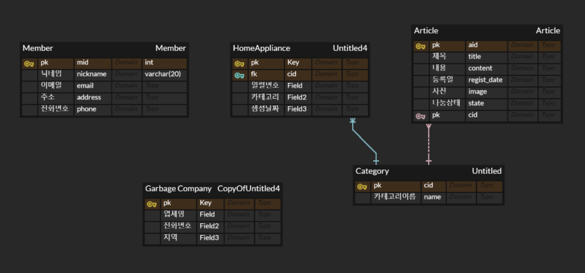

# 프로젝트 소개
EchoCirecle을 이용하여 폐가전제품을 간편히 처리하세요!  
현대 사회에서 가전제품의 사용 수명이 짧아지면서 폐가전의 처리가 중요한 문제로 대두되고 있습니다.  
그러나 기존 폐가전을 처리하기 위한 절차는 복잡하고 번거로워 많은 사람들이 올바르게 폐기하지 못하고 있습니다.  
이에 따라 저희는 이러한 절차를 간소화하고, 기업이 수거된 폐가전을 재활용하여 가치를 창출함으로써 ESG(환경, 사회, 지배구조) 경영과 환경 문제 해결에 기여할 수 있는 방안을 모색하게 되었습니다.  

# ERD

https://www.erdcloud.com/d/6jomkNA9rrzGY5y8h

# 팀원 소개

|이름|담당 업무|
|------|---|---|
|김현식(팀장)|Backend, Infra, BigData|
|최우석|Frontend, AI, Crawling|
|이지은|Backend, Frontend, Design|

# Git Rule

- 메인에서 Develop 브랜치 생성하여 버전 관리 진행
- Develop 브랜치로부터 필요한 브랜치를 생성한다
- 브랜치는 총 4가지 종류의 브랜치가 존재한다
    1. Feature
        1. 기능을 추가하기 위한 브랜치다
    2. Fix
        1. 기능을 수정하기 위한 브랜치다
    3. Update
        1. 이미 존재하는 기능을 업데이트 할 때 사용하는 브랜치다
    4. HotFix
        1. 필요한 경우에 빠른 작업을 위해 메인테이너 3명중 2명 이상의 동의를 받고 메인에 직접 작업 할 수 있는 브랜치다
- 브랜치 네이밍 규칙
    - [Feature, Fix, Update, HotFix] + / + [동사 + 명사] + / + [작성자를 나타내는 명칭]
    - 동사와 명사중 필요에 따라 동사는 생략 가능
    - 동사와 명사 첫글자는 대문자
    - 작성자 명칭은 모두 대문자
    - 브랜치 명에 /가 불가능할 경우 _로 대체
    
    | 이름 | 명칭 |
    | --- | --- |
    | 김현식 | SIK |
    | 최우석 | WOO |
    | 이지은 | JI |

- Git Message 룰
    - 한글로 작성을 기본으로 하되, 영어 단어 사용 가능

Frontend

- components 이름은 pascal case 적용(첫 글자 대문자)
- Non-components 이름은 Camel case
- Unit test 파일명은 대상 파일명과 동일하게 작성
- 속성명은 Camel case로 작성
- inline 스타일은 Camel case로 작성
- 컨벤션 관련 링크

[[react] react 코딩 컨벤션](https://phrygia.github.io/react/2022-04-05-react/)

Backend

- 기본 변수는 Camel case 적용
    
    ex) int addNum;
    
- const, final 사용 시 모두 대문자로 적용
    
    ex) final int NUMBER;
    
- public, private은 구분하지 않는다
- 클래스 이름의 첫글자는 대문자로
    
    ex) class Car; class StudentManager;
    
- 메소드 이름 Camel case 적용
    
    ex) void printName();

